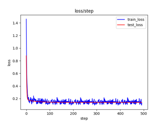
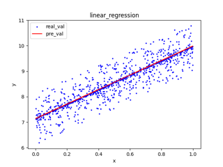
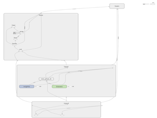

### AI学习入门资料整理（边学习边整理）
#### 人工智能学习相关资料整理 
- 梳理人工智能开发一些常规概念
- [常用人工智能开发主流框架及其优缺点](articles/code_relation/1_ai_framework.md)
- 人工智能分支路线及分支相关技术
- [开源人工智能相关工具包](articles/code_relation/3_third_collection.md)
#### 人工智能学习相关示例代码整理，包括tensorflow1.x、tensorflow2.x、pytorch实现
- 通过python3.x版本实现
- 只涉及机器学习、深度学习相关代码，非python入门示例代码
   - Hello World：
     - 支持常量、变量、矩阵、占位符使用
     - 支持加、减、乘、除、转置数学运算
     - 矩阵乘法及矩阵逐元素相乘效果对比
     - [tensorflow1.x实现](example_code/tensorflow_v1/1_base/1_hello_world.py)
     - [tensorflow2.x实现](example_code/tensorflow_v2/1_base/1_hello_world.py)
     - [pytorch实现](example_code/tensorflow_v2/1_base/1_hello_world.py)
   - 简单线性回归模型实现：
     - 支持设置epouchs(迭代次数)、batch_size(批次大小)、wrap_rate(预热比例)参数
     - 支持训练集/测试集 loss曲线、离散点效果图展示（matlab python库实现）
     - 支持模型的训练、模型保存与恢复。
     - 支持模型网络结构展示（tensorflow board实现）
     - [tensorflow1.x实现](example_code/tensorflow_v1/2_base_models/1_simple_linear_regression.py)
     - [tensorflow2.x实现](example_code/tensorflow_v2/2_base_models/1_simple_linear_regression.py)
     - [pytorch实现](example_code/tensorflow_v2/2_base_models/1_simple_linear_regression.py)    
     
    loss曲线图                  |  离散点图                   | 网络图
    :-------------------------:|:-------------------------:|:-------------------------:
      |     |  
     
     
- 常用小工具，例如爬虫，[自动化中英文翻译工具](example_code/tools/nlp_translation/README.md)（google、baidu、deepl、有道、彩云等）
  - 自动化机器翻译：中文——>英文；英文——>中文，实时保存 
     - [deepl平台自动化翻译（selenium+chromedriver）](example_code/tools/nlp_translation/deepl_translation.py)
     - [google平台自动化翻译（selenium+chromedriver）](example_code/tools/nlp_translation/google_translation.py)
     - [百度平台自动化翻译（selenium+chromedriver）](example_code/tools/nlp_translation/baidu_translation.py)
     - [百度平台自动化翻译（百度翻译api实现）](example_code/tools/nlp_translation/baidu_translation_by_api.py)
     - [有道平台自动化翻译（selenium+chromedriver）](example_code/tools/nlp_translation/youdao_translation.py)
     - [彩云平台自动化翻译（selenium+chromedriver）](example_code/tools/nlp_translation/caiyun_translation.py)  
     
- 搭建简单人工智能训练平台
#### 业务模块的技术方案梳理
- 整理图像、文本、语音具体任务及实现方案

#### 示例代码运行
```
#pytorch 版本安装
pip install -r  example_code/pytorch/requirements.txt

#tensorflow_v1 版本安装
pip install -r  example_code/tensorflow_v1/requirements.txt

#tensorflow_v2 版本安装
pip install -r  example_code/tensorflow_v2/requirements.txt

```
