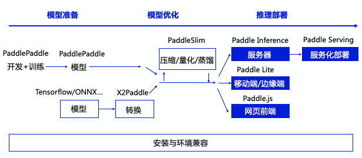

### 常见开源ai深度学习框架
#### 介绍
##### caffe
 - caffe为伯克利人工智能研究小组和伯克利视觉和学习中心开发。2017年4月发布caffe2，2018年3月合并到pytorch。
 - git地址：https://github.com/BVLC/caffe.git
 - 通过c++实现，提供python接口

##### tensorflow
- tensorflow 为**谷歌**2015年11月发布。
- 中文官方网站 https://tensorflow.google.cn，提供各版本基础学习资源、api文档、社区论坛及各种外部扩展功能
- git地址：https://github.com/tensorflow/tensorflow.git
- 支持多种**c++、python、javascript语言，非官方版支持java**。python\java版本内部实现调用的c\c++完成  
  - javascript版本：
    - 通过WebGL实现模型训练与预测。
    - 通过localStorage,IndexDB实现存储与加载。所有操作都通过浏览器在客户端完成
- 通过TensorFlow Lite版本支持在android、ios移动设备上运行,通过pc端训练好模型，转换成移动端模型结构，通过Lite版预测。
- 通过Tensorflow Extended提供工业部署的外围扩展，包括：
  - 训练数据验证、清洗、转换
  - 模型效果分析辅助模型优化
  - 模型服务发布与管理（工业化应用）
- **通过tensorflow board实现模型训练过程及训练结果的可视化展示，方便算法工程师进行算法优化。（意义重大）**
- 通过tensorflow hub 提供在线成熟的算法模型（一般使用不多）
- tensorflow主框架存在两套不兼容的大版本1.x\2.x：
  - 1.x版本主要采用静态图结构，先定义好模型结构，在Session中运行，代码复杂一些，需要改变之前编码思维，理解这种类似于硬件电力设计，通电测试的这种思维模式。
  - 2.x目前主流模式，也是官方目前主要升级版本，摒弃了1.x中的以静态图设计的主要模式，精简了代码调用流程，学习成本降低了不少。

##### pytorch
- 2017年1月由Facebook人工智能研究院（FAIR）基于Torch推出了PyTorch
- git地址：https://github.com/pytorch/pytorch.git
- 官方网站：https://pytorch.org/  
- 中文文档：https://pytorch.apachecn.org
- 支持 ** c++、python、java ** 
- 通过pytorch mobile支持android\ios移动端开发。
  - pytorch live https://github.com/pytorch/live.git(移动端开发脚手架，混合开发模式）
  - android demo app https://github.com/pytorch/android-demo-app.git
  - ios demo app https://github.com/pytorch/is-demo-app.git

##### PaddlePaddle
  - PaddlePaddle，中文名飞桨，是百度研发的开源开放的深度学习平台，是国内最早开源、也是当前唯一一个功能完备的深度学习平台，2018年7月发布第一个开源版本
  - 中文官方网站：https://www.paddlepaddle.org.cn/
  - git地址：https://github.com/PaddlePaddle/Paddle.git
  - gitee地址：https://gitee.com/paddlepaddle/Paddle
  - Paddle-Lite 支持 **c++、python、java**,基础班支持 **python**
  - Paddle-Lite 轻量版 https://github.com/PaddlePaddle/Paddle-Lite，支持android\ios
  - paddle.js支持在浏览器端加载模型预测（需要先通过转换将paddle训练好的模型转换成paddle.js支持格式），目前通过WebGL实现
  - 有完善的社区、文档、示例代码、视频等教学资源，并提供众多中文在线基础模型。
  - 有自己的模型训练及模型效果可视化展示平台：VisualDL
  - 支持分布式训练：FeetAPI
  - 有在线编码调试，训练平台：PaddleCloud
  - 有量子深度学习框架：paddle-quantum
  - 支持多任务学习框架（主要针对NLP）PLAM
  - 有自己的预训练模型工具 paddle hub（NLP中的预训练模型文心[ERNIE]）
  - 有自己的推理库  paddle inference
  - 其他配套组件，例如数据清洗、增强、转换组件；模型压缩、转换组件；模型服务部署组件
  - 通过X2Paddle支持将tensorflow、caffe模型转换为 paddlepaddle模型
  - paddlepaddle开发流程：
  
  
#####其他（未了解）
 - Theano
 - MXNet
