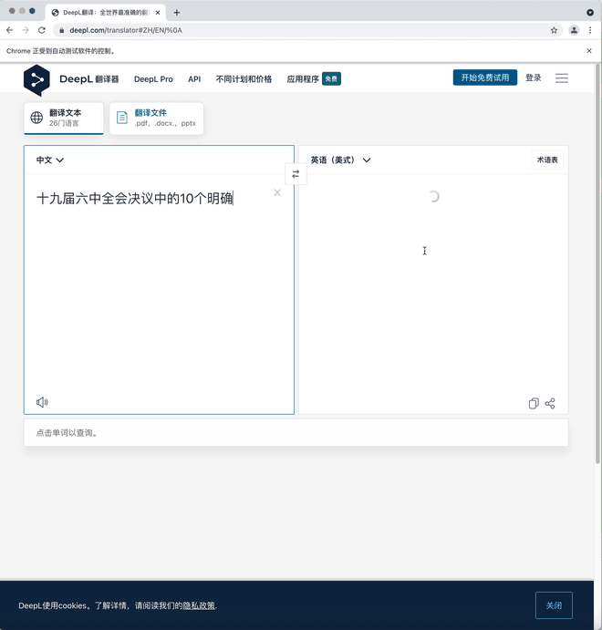

### NLP 文本翻译工具集合
- 作用：增强训练预料，提高模型泛化能力，例如文本分类模型，语义相似度模型等。
- 支持翻译：deepl、google、百度、有道、彩云
- 支持方式：除百度支持api外，其他都是以自动化爬取的方式实现
- 实现方式：
  - deepl、google、有道、彩云、百度采用自动化测试平台selenium+chromedevice实现。
    - **selenium 版本4.1.0(低版本存在兼容性问题，需要手工调整部分代码)、chrome 版本96（程序中plugin下的驱动也是采用该版本，其他版本可自行从 https://chromedriver.chromium.org/downloads 需要和本地chrome版本保持一致，无法下载可通过vpn代理）**
    - **google 翻译需要设置本地dns，添加8.8.8.8 dns 解析**
    - 因为通过模拟人工在界面上操作，翻译速度没有直接通过接口调用快。
  - 百度另支持api方式，但需要通过百度翻译平台(https://api.fanyi.baidu.com)创建相应的应用，获取app_id、app_key具体参考 [baidu_translation_by_api.py](baidu_translation_by_api.py)
- 数据格式：参考[data\sample_data.json](data\sample_data.json )  
- 功能：
  - 目前脚本都是按中英文相互翻译 中文——>英文；英文——>中文逻辑自行。有需要其他语言翻译、或有其他逻辑可自行修改
  - 采用边翻译变保存模式，异常也不会再重头开始翻译。
- 注意事项：
  - **采用自动化平台selenium方式，通过模拟人工操作，占用系统复制、粘贴操作，翻译时，需要先准备好能独占的系统，逐个翻译脚本执行，避免出现快捷键串的情况。**
  - **如果想通过中文——>英文；英文——>中文方式实现语料增强，建议先统一将所有的预料翻译成英文，再翻译回来，切勿修改成逐条中文——>英文；英文——>中文翻译，因为平台都有缓存机制，逐条翻译会和原中文一模一样，这样就失去了翻译的目的。**
  - **采用自动化平台selenium方式，各平台都有反爬虫机制，会出现超过使用次数的情况，这时候，脚本会重新打开chrome，目前没有分别捕捉各平台出现超出使用次数异常的具体逻辑，但凡出现异常就会重新打开chrome，如果是其他异常原因，会反复重启，后续需要优化**
  - 采用自动化平台selenium方式需要根据翻译内容及网络情况，调整翻译等待时间（目前设置的是3秒），避免长文本未翻译完就执行保存逻辑
  
    

